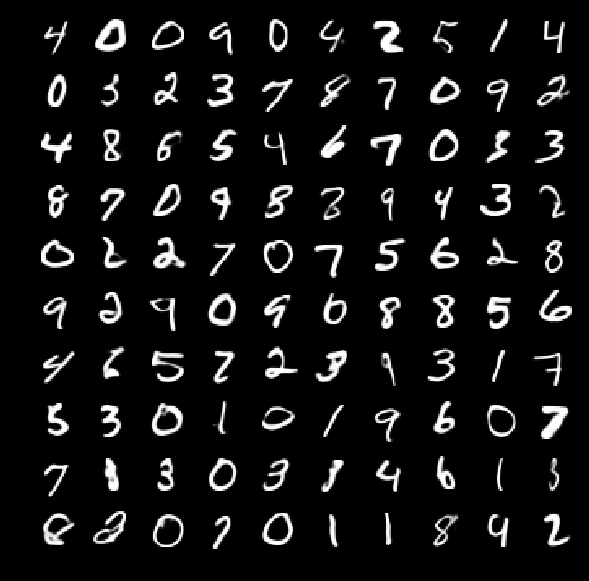
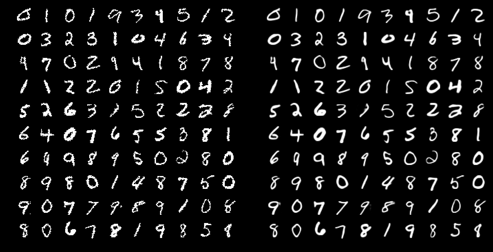

# Variational Autoencoder with Inverse Autoregressive Flow

This is an implementation of a deep variational autoencoder with inverse autoregressive flow (Kingma et al., "Improving 
Variational Inference with Inverse Autoregressive Flow", NIPS 2016, arxiv.org/abs/1606.04934) with some minor 
modifications. It's currently only implemented for modeling dynamically binarized MNIST. 

## How to run

* run_script.py is a script in which all parameters for the calculation are provided and which executes the calculation.

## Some features

* You can specify different encoders and decoders.
    * IAF_ENCODER: CNN-based ResNet with 6 blocks total, 2 of them being downsampling blocks via strided convolutions.
    It uses 64 feature maps in each CNN layer and the kernel size is 3x3.
    * IAF_DECODER: Same as above, but with transposed convolutions and 2 upsampling blocks.
    * SNF_ENCODER: Encoder without residual connections, but only gated convolutions with 5x5 kernels. This should 
    correspond to the encoder used in the Sylvester Normalizing Flows paper (arxiv.org/abs/1803.05649).
    * SNF_DECODER: Same as above, but with transposed convolutions.
    * NONCONV_ENCODER: Encoder based on simple fully-connected layers. Number of layers and units per layer can be 
    specified by the user (note that the neural network input is provided to every layer).
    * NONCONV_DECODER: Same as NONCONV_ENCODER, but without batchnorm in the output layer.

All models use ELU nonlinearities and the IAF_EN/DECODERS and NONCONV_EN/DECODERS also use batchnorm.

You can add an inverse autoregressive flow that is parametrized via MADEs (arxiv.org/abs/1502.03509) which include 
context (cMADE). It is used to better model the approximate posterior. The number of flow layers can be 
varied and the cMADE architectures can be changed, too. The parameters in the run_script.py for that should be 
self-explanatory. One important difference compared to the reference paper is that my cMADE uses batch normalization 
instead of weight normalization and does not use data-dependent initialization. For MNIST, this worked just fine, but I 
could image that when modeling more complex data, such as CIFAR10, it will make a difference and weightnorm with 
data-dependent init will work better. I also found that, unsurprisingly, without any normalization in the cMADE layers 
training can be unstable easily.

I also implemented different techniques to estimate the log-likelihood of the final model. It can be estimated 
with standard importance sampling in latent space, using the approximate posterior distribution as the proposal 
distribution. Additionally, I implemented Hamiltonian Annealed Importance Sampling (HAIS, see, e.g., 
arxiv.org/abs/1611.04273). As start distribution for the annealing path one can use either the prior or the base 
distribution of the approximate posterior and all details of the HAIS algorithm can be specified by the user. The 
Leapfrog stepsize of the HMC algorithm is adapted dynamically such that HMC proposals are accepted with the target 
acceptance rate. Unfortunately, I found HAIS-based log-likelihood estimation to be unpractically slow for more complex 
models due the large number of annealing steps required to obtain accurate results.

Note that the code also prints a logfile and provides some basic tensorboard training curves. After training, it saves 
the model, draws new images from the model, and compares inputs with reconstructions. Furthermore, note that the code 
makes use of tensorflow_datasets and downloads the MNIST dataset for you.

## Results

I did some basic tests of the code and the best performing model was a VAE with a ResNet encoder and decoder and an 
inverse autoregressive flow with 8 flow layers in the approximate posterior (see default setup in run_script.py). The 
marginal log-likelihood log p(x) was estimated via importance sampling with 1000 samples using the approximate 
posterior as proposal distribution.

Train set neg. ELBO: 78.82  
Test set neg. ELBO: 80.53  
Test set neg. log p(x): 78.74

These results are even better than the results in the reference paper. This is probably because my model is more 
expressive than the model used in the IAF paper. I used 64 latent units instead of 32 and I also used more feature 
maps in the convolutions in the ResNets (64 in each CNN layer). At the time of the publication, the reference result 
(79.10 nats) was state of the art already, so the authors didn't have to push the model as far as I did. My 78.74 nats 
on dynamically binarized MNIST is close to the results achieved by the variational lossy autoencoder 
(arxiv.org/abs/1611.02731) and other advanced generative models such as DVAE++ (arxiv.org/abs/1802.04920) and it is 
not much worse than the current state of the art.

At the bottom of this page are new samples from the final model as well as reconstructions of input data. The 
reconstructions look well and the MNIST digits generated by the model are also rather pretty (it's not that difficult 
to model MNIST, though).

The code was validated with TensorFlow 1.12.0 using a GTX 1080 Ti GPU.

## Outlook

If I have time, I may extend the code and add more flows (neural autoregressive flows, Sylvester normalizing flows, 
etc.), more powerful decoders (e.g. PixelCNN), or I may extend the code to allow to model other, more interesting 
datasets. I may also add weightnorm and data-dependent initialization. One could also put a flow in the prior, like in 
the variational lossy autoencoder.

## Visualizations

New samples generated by the model:

Reconstructions:
